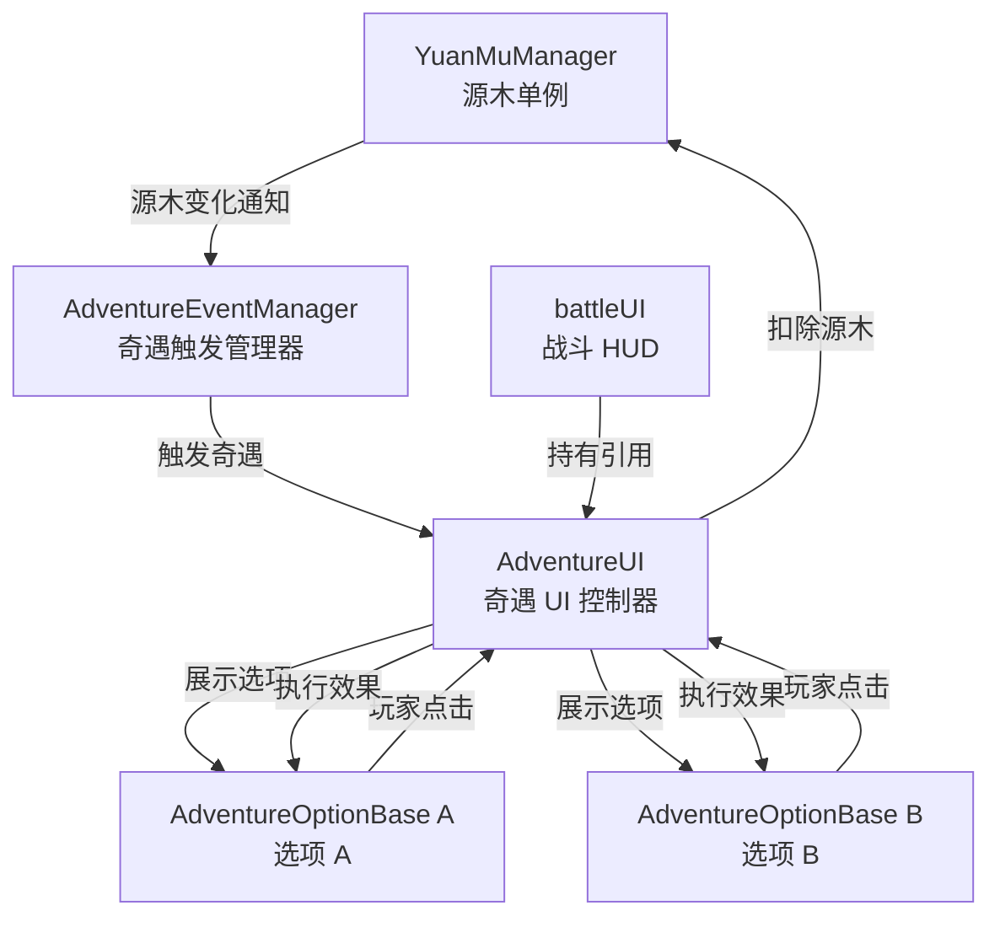
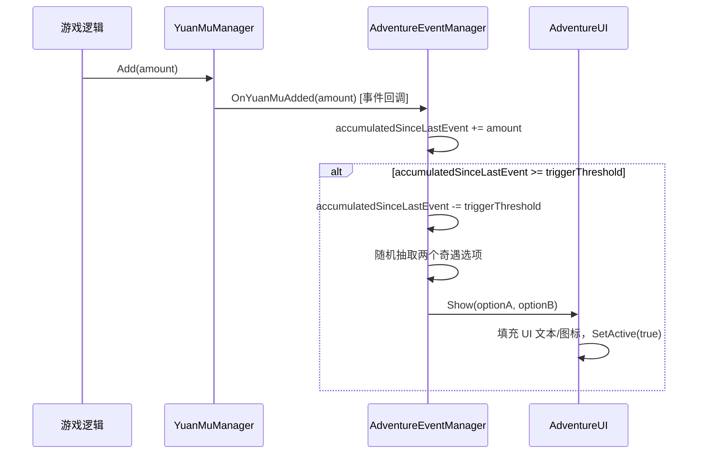

# 设计文档：奇遇系统（Adventure Event System）

## 概述

奇遇系统在玩家每累计获得一定数量的源木时触发，弹出一个二选一的奇遇选项 UI。玩家选择后扣除对应源木并执行奇遇效果。与升级 UI 不同，奇遇 UI **不暂停游戏**，玩家可在战斗中随时操作。

奇遇效果采用类似 `Upgradeoptionsbase` 的可扩展基类结构，便于后续添加各类具体效果。

---

## 架构



### 关键设计决策

- **不暂停游戏**：`AdventureUI` 显示时不调用 `Time.timeScale = 0`，与 `ChoiceUI`（升级 UI）的行为相反。
- **触发计数器独立**：`AdventureEventManager` 维护一个累计源木计数器，与 `YuanMuManager.Current` 解耦，避免存档/重置干扰触发逻辑。
- **可配置阈值**：触发阈值通过 `[SerializeField]` 暴露在 Inspector，默认 200。
- **选项数据驱动**：奇遇选项为 ScriptableObject 或 MonoBehaviour 预制体，挂载 `AdventureOptionBase` 子类，结构与 `Upgradeoptionsbase` 一致。

---

## 序列图

### 触发流程



### 选择流程

```mermaid
sequenceDiagram
    participant Player as 玩家
    participant AUI as AdventureUI
    participant Opt as AdventureOptionBase
    participant YMM as YuanMuManager

    Player->>AUI: 点击选项按钮
    AUI->>Opt: CanAfford() → bool
    alt 源木足够
        AUI->>YMM: Spend(option.cost)
        AUI->>Opt: Execute()
        AUI->>AUI: Hide()
    else 源木不足
        AUI->>AUI: 显示"源木不足"提示
    end
```

---

## 组件与接口

### 1. AdventureEventManager

**职责**：监听源木增加事件，维护累计计数，达到阈值时触发奇遇。

```csharp
public class AdventureEventManager : MonoBehaviour
{
    [SerializeField] private int triggerThreshold = 200; // 可配置触发阈值
    [SerializeField] private List<AdventureOptionBase> optionPool; // 奇遇选项池

    private int accumulatedSinceLastEvent = 0;

    // 由 YuanMuManager 在 Add() 后调用，或通过 C# event 订阅
    public void OnYuanMuAdded(int amount);

    // 从 optionPool 随机抽取两个不重复选项
    private (AdventureOptionBase, AdventureOptionBase) PickTwoOptions();

    // 触发奇遇，通知 AdventureUI 显示
    private void TriggerEvent(AdventureOptionBase optA, AdventureOptionBase optB);
}
```

**说明**：
- `triggerThreshold` 默认 200，可在 Inspector 修改。
- `optionPool` 在 Inspector 中配置，支持运行时动态增减。
- 每次触发后 `accumulatedSinceLastEvent` 减去阈值（而非清零），保留溢出量，避免多余源木丢失。

---

### 2. AdventureUI

**职责**：显示二选一奇遇 UI，处理玩家点击，扣除源木并执行效果。

```csharp
public class AdventureUI : MonoBehaviour
{
    [Header("UI 引用")]
    public TextMeshProUGUI titleText;
    public Button buttonA;
    public Button buttonB;
    public TextMeshProUGUI nameA, descA, costA;
    public TextMeshProUGUI nameB, descB, costB;
    public Image iconA, iconB;
    public TextMeshProUGUI insufficientFundsHint; // "源木不足"提示

    private AdventureOptionBase _optionA;
    private AdventureOptionBase _optionB;

    // 由 AdventureEventManager 调用，填充数据并显示
    public void Show(AdventureOptionBase optA, AdventureOptionBase optB);

    // 隐藏 UI（不恢复 timeScale）
    public void Hide();

    // 按钮回调
    public void OnClickA();
    public void OnClickB();

    // 内部：尝试执行选项
    private void TryExecute(AdventureOptionBase option);
}
```

**说明**：
- `Show()` 调用 `gameObject.SetActive(true)`，**不修改** `Time.timeScale`。
- `Hide()` 调用 `gameObject.SetActive(false)`，**不修改** `Time.timeScale`。
- 源木不足时显示 `insufficientFundsHint`，不关闭 UI，允许玩家选另一项。

---

### 3. AdventureOptionBase

**职责**：奇遇选项的可扩展基类，定义数据字段和效果接口。结构对标 `Upgradeoptionsbase`。

```csharp
public class AdventureOptionBase : MonoBehaviour
{
    [Header("基础信息")]
    public string optionName;        // 选项名称
    public string optionDescription; // 选项描述
    public int cost;                 // 源木费用
    public Sprite icon;              // 选项图标（可选）

    // 检查玩家是否负担得起
    public bool CanAfford()
    {
        return YuanMuManager.Instance != null &&
               YuanMuManager.Instance.Current >= cost;
    }

    // 执行奇遇效果（子类重写）
    public virtual void Execute() { }
}
```

**子类扩展示例**（框架占位，具体效果后续补充）：

```csharp
// 示例：给玩家回血
public class AdventureHeal : AdventureOptionBase
{
    public int healAmount;
    public override void Execute()
    {
        // TODO: player.Heal(healAmount);
    }
}

// 示例：临时增益 buff
public class AdventureBuff : AdventureOptionBase
{
    public float duration;
    public override void Execute()
    {
        // TODO: 应用 buff
    }
}
```

---

### 4. YuanMuManager（扩展）

在现有 `Add(int amount)` 方法中增加事件通知，**不破坏现有接口**：

```csharp
// 新增：源木增加事件
public static event System.Action<int> OnYuanMuAdded;

public void Add(int amount)
{
    if (amount <= 0) return;
    _current += amount;
    OnYuanMuAdded?.Invoke(amount); // 新增通知
}

// 新增：扣除源木（供 AdventureUI 调用）
public bool Spend(int amount)
{
    if (_current < amount) return false;
    _current -= amount;
    return true;
}
```

---

## 数据模型

### AdventureOptionData（选项数据）

| 字段 | 类型 | 说明 |
|------|------|------|
| `optionName` | `string` | 选项名称，显示在 UI 标题 |
| `optionDescription` | `string` | 选项描述文本 |
| `cost` | `int` | 源木费用，≥ 0 |
| `icon` | `Sprite` | 选项图标，可为 null |

**验证规则**：
- `cost >= 0`（免费选项合法）
- `optionName` 非空
- `cost <= YuanMuManager.Instance.Current` 才允许执行

### AdventureEventManager 状态

| 字段 | 类型 | 说明 |
|------|------|------|
| `triggerThreshold` | `int` | 触发阈值，默认 200，> 0 |
| `accumulatedSinceLastEvent` | `int` | 上次触发后累计的源木量，∈ [0, triggerThreshold) |
| `optionPool` | `List<AdventureOptionBase>` | 可用选项池，至少 2 个 |

---

## 正确性属性

```csharp
// 属性 1：触发阈值正确性
// 对任意 Add(n) 调用序列，当累计量首次 >= triggerThreshold 时触发奇遇
Assert(accumulatedSinceLastEvent < triggerThreshold); // 触发后始终成立

// 属性 2：源木守恒
// Spend(cost) 成功后，Current 减少恰好等于 cost
// ∀ cost ≥ 0: Spend(cost) == true → Current_after == Current_before - cost

// 属性 3：不暂停游戏
// AdventureUI.Show() 和 Hide() 前后，Time.timeScale 不变
Assert(Time.timeScale == timeScaleBefore); // Show/Hide 调用后成立

// 属性 4：源木不足时不执行效果
// ∀ option: !option.CanAfford() → Execute() 不被调用

// 属性 5：选项池非空时必能抽出两个选项
// optionPool.Count >= 2 → PickTwoOptions() 返回两个不同选项

// 属性 6：溢出量保留
// 若 accumulated = threshold + overflow（overflow > 0），触发后 accumulatedSinceLastEvent == overflow
```

---

## 错误处理

| 场景 | 处理方式 |
|------|----------|
| 选项池少于 2 个 | `AdventureEventManager` 在 `TriggerEvent` 前检查，不足则跳过触发，打印警告日志 |
| 点击时源木不足 | 显示 `insufficientFundsHint`，不关闭 UI，不执行效果 |
| `YuanMuManager.Instance` 为 null | `CanAfford()` 返回 false，`Spend()` 直接返回 false |
| 奇遇 UI 已显示时再次触发 | `AdventureEventManager` 检查 `AdventureUI.IsShowing`，若已显示则将本次触发加入队列或丢弃（待定） |

---

## 测试策略

### 单元测试

- `AdventureEventManager.OnYuanMuAdded`：验证累计计数和触发时机
- `YuanMuManager.Spend`：验证扣除逻辑和边界（恰好够、不够、超额）
- `AdventureOptionBase.CanAfford`：验证与 `YuanMuManager.Current` 的比较

### 属性测试

- 对任意正整数序列调用 `Add()`，验证触发次数 == `sum / triggerThreshold`（整除）
- 验证 `accumulatedSinceLastEvent` 始终在 `[0, triggerThreshold)` 范围内

### 集成测试

- 完整流程：Add 源木 → 触发 UI → 点击选项 → 验证源木扣除 + 效果执行 + UI 关闭
- 验证战斗计时器在奇遇 UI 显示期间继续运行（`Time.timeScale == 1`）

---

## 依赖

| 依赖 | 说明 |
|------|------|
| `YuanMuManager` | 源木单例，需扩展 `Spend()` 和 `OnYuanMuAdded` 事件 |
| `battleUI` | 持有 `AdventureUI` 的 GameObject 引用，用于显示/隐藏 |
| `TextMeshPro` | UI 文本组件 |
| `Upgradeoptionsbase`（参考） | 结构参考，不直接依赖 |
