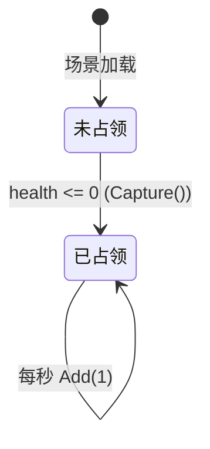

# 设计文档：营地与源木系统

## 概述

本设计在现有 Unity C# Roguelite 游戏基础上，新增**营地（Camp）**与**源木（YuanMu）货币**两个系统。

营地是场景中固定放置的可攻击对象，继承自 `enemy` 类，复用现有子弹碰撞伤害逻辑（`CompareTag("enemy")`）。血量归零后触发占领流程：切换外观、掉落经验、并持续每秒产出 1 单位源木。

源木由 `YuanMuManager` 单例统一管理，数量实时显示在现有 `battleUI` 的 HUD 中。

---

## 架构

```mermaid
graph TD
    Bulletbase -->|OnTriggerEnter CompareTag enemy| Camp
    Camp -->|继承| enemy
    enemy -->|继承| Attribute
    Camp -->|占领后每秒 Add(1)| YuanMuManager
    battleUI -->|Update 轮询 Current| YuanMuManager
    Camp -->|持有引用| CampHealthBar
    CampHealthBar -->|读取 health/healthmax| Camp
```

**关键设计决策：**

1. `Camp` 继承 `enemy`，携带 `"enemy"` 标签，使 `Bulletbase.OnTriggerEnter` 无需任何修改即可对营地造成伤害。
2. `Camp` 覆写（override）`Destroy1()` 方法，将"死亡销毁"替换为"占领流程"，避免修改 `Bulletbase` 中的 `enemy.Destroy1()` 调用。
3. `YuanMuManager` 采用经典 Unity 单例模式（`Instance` 静态属性 + `DontDestroyOnLoad` 可选），提供 `Add(int)` 与只读 `Current` 接口。
4. `battleUI` 通过 `Update` 每帧轮询 `YuanMuManager.Current`，无需事件系统，保持与现有代码风格一致。
5. 营地血条使用 **World Space Canvas**，挂载在 Camp GameObject 的子对象上，自动跟随营地位置，通过 `LookAt` 实现 Billboard 效果。

---

## 组件与接口

### Camp.cs

继承 `enemy`，挂载在营地 Prefab 上。

```
Camp : enemy
├── 字段
│   ├── bonusExpCount: int          // Inspector 可调，占领时额外掉落经验石数量
│   ├── capturedSprite: Sprite      // 占领后替换的 Sprite
│   ├── healthBar: CampHealthBar    // 子对象血条引用
│   └── isCaptured: bool            // 是否已被占领（私有）
├── 覆写方法
│   └── Destroy1()                  // 覆写 enemy.Destroy1()，触发占领流程
└── 私有方法
    ├── Capture()                   // 占领流程：换外观、掉落经验、启动协程
    └── YuanMuCoroutine()           // 每秒 Add(1) 的协程
```

**关键接口约定：**
- `Camp` 不覆写 `FixedUpdate`，而是在 `OnEnable` 中将 `rolestate` 强制设为 `state.idle` 并禁用移动逻辑（通过覆写 `FixedUpdate` 跳过 move 分支）。
- `OnCollisionEnter` 被覆写为空方法，禁用对玩家的碰撞伤害。

### YuanMuManager.cs

全局单例，挂载在场景中的空 GameObject 上。

```
YuanMuManager : MonoBehaviour
├── 静态属性
│   └── Instance: YuanMuManager    // 单例访问点
├── 公开属性
│   └── Current: int { get; }      // 只读，当前源木数量
└── 公开方法
    └── Add(amount: int): void      // amount > 0 时增加源木
```

### CampHealthBar.cs

挂载在 Camp 子对象（World Space Canvas）上，负责血条显示与 Billboard。

```
CampHealthBar : MonoBehaviour
├── 字段
│   ├── fillImage: Image            // 血条填充 Image
│   └── camp: Camp                  // 父营地引用（Awake 中 GetComponentInParent）
└── 方法
    ├── UpdateBar(float ratio)      // 更新 fillImage.fillAmount
    └── Hide()                      // 隐藏血条 Canvas
```

### battleUI.cs 扩展

在现有 `battleUI` 中新增：

```
battleUI（扩展）
└── 新增字段
    └── yuanmuText: TextMeshProUGUI // Inspector 拖入，显示源木数量
```

`Update()` 末尾追加：
```csharp
if (YuanMuManager.Instance != null)
    yuanmuText.text = "源木: " + YuanMuManager.Instance.Current;
```

---

## 数据模型

### Camp 配置字段（Inspector 可调）

| 字段 | 类型 | 默认值 | 说明 |
|------|------|--------|------|
| `health` | int | 继承自 Attribute | 营地初始血量 |
| `healthmax` | int | 继承自 Attribute | 营地最大血量 |
| `bonusExpCount` | int | 5 | 占领时额外掉落经验石数量 |
| `capturedSprite` | Sprite | null | 占领后替换的 Sprite |
| `expstone` | GameObject | 继承自 enemy | 经验石 Prefab |

### YuanMuManager 运行时状态

| 字段 | 类型 | 初始值 | 说明 |
|------|------|--------|------|
| `_current` | int | 0 | 当前源木数量（私有） |

### 营地状态机



营地不使用 `enemy` 的 idle/move/dead 状态机，`rolestate` 始终保持 `idle`，`FixedUpdate` 中 move 分支被覆写跳过。

---

## 正确性属性

*属性（Property）是在系统所有合法执行路径上都应成立的特征或行为——本质上是对系统应做什么的形式化陈述。属性是人类可读规范与机器可验证正确性保证之间的桥梁。*

### 属性 1：营地位置不变性

*对于任意* 初始位置的 Camp，经过任意帧数的 `FixedUpdate` 调用后，其 `transform.position` 应与初始位置完全相同（不执行 move 状态逻辑）。

**验证需求：1.2**

### 属性 2：碰撞不伤害玩家

*对于任意* 玩家血量值，Camp 的 `OnCollisionEnter` 被触发后，玩家血量应保持不变（覆写为空方法）。

**验证需求：1.3**

### 属性 3：占领后 GameObject 持续存在

*对于任意* 初始血量大于 0 的 Camp，当累计受到的伤害总量 >= `healthmax` 时，`isCaptured` 应变为 `true`，且 Camp 的 `GameObject` 不被销毁（`Destroy1()` 覆写不调用 `Destroy(gameObject)`）。

**验证需求：1.5, 2.5**

### 属性 4：占领掉落数量正确性

*对于任意* `bonusExpCount` 配置值（正整数），触发占领流程后，在营地位置生成的 `expstone` 实例数量应等于 `bonusExpCount`。

**验证需求：2.2**

### 属性 5：源木累加正确性

*对于任意* 初始源木值和任意长度的正整数序列，依次调用 `YuanMuManager.Add`，`Current` 应等于初始值加上序列中所有值之和。

**验证需求：4.3**

### 属性 6：非正数 Add 调用无副作用

*对于任意* 当前源木值，调用 `Add(amount)`（其中 `amount <= 0`），`Current` 应保持不变。

**验证需求：4.4**

### 属性 7：血条填充比例正确性

*对于任意* Camp 的 `health` 值（范围 `[0, healthmax]`），调用 `CampHealthBar.UpdateBar` 后，`fillImage.fillAmount` 应等于 `(float)health / healthmax`，误差不超过浮点精度（1e-6）。

**验证需求：3.2**

### 属性 8：源木文本格式正确性

*对于任意* 非负整数 `n`，当 `YuanMuManager.Current == n` 时，`battleUI.Update` 执行后源木文本应严格等于 `"源木: " + n`。

**验证需求：5.2**

### 属性 9：占领后持续产出

*对于任意* 已占领的 Camp，经过 `t` 秒（`t` 为正整数），`YuanMuManager.Current` 的增量应等于 `t`（允许 ±1 帧时间误差）。

**验证需求：2.3, 2.4**

---

## 错误处理

| 场景 | 处理方式 |
|------|----------|
| `YuanMuManager.Instance` 为 null（场景未初始化） | `battleUI.Update` 中加 null 检查，跳过文本更新 |
| `Camp.capturedSprite` 未配置（为 null） | `Capture()` 中跳过 Sprite 替换，仅执行其他占领逻辑 |
| `Camp.healthBar` 引用丢失 | `Destroy1()` 覆写中加 null 检查 |
| `Add(amount <= 0)` 调用 | `YuanMuManager.Add` 直接 return，不修改 `_current` |
| 营地被多次触发占领（并发伤害） | `isCaptured` 标志位保证 `Capture()` 只执行一次 |
| `Bulletbase` 对已占领营地造成伤害 | `enemy.health <= 0` 时 `Bulletbase` 调用 `Destroy1()`，Camp 覆写后检查 `isCaptured`，直接 return |

---

## 测试策略

### 单元测试（Unity Test Framework - EditMode）

针对纯逻辑部分，不依赖场景：

- `YuanMuManager.Add` 正数累加正确
- `YuanMuManager.Add` 非正数无副作用
- `YuanMuManager` 初始值为 0
- 血条填充比例计算：`health / healthmax` 精度
- 源木文本格式：`"源木: " + n`

### 属性测试（Unity Test Framework - EditMode + 手动随机生成）

由于 Unity 生态缺乏成熟的 PBT 库，采用 **参数化随机测试** 方案：在 EditMode 测试中手动生成随机输入，循环执行 ≥100 次，模拟属性测试行为。

每个属性测试需在注释中标注：
`// Feature: camp-and-yuanmu-system, Property {编号}: {属性描述}`

**属性测试列表：**

| 测试名 | 对应属性 | 随机输入 | 验证内容 |
|--------|----------|----------|----------|
| `Test_Camp_NoMove` | 属性 1 | 随机初始位置（100次） | `position` 不变 |
| `Test_Camp_NoCollisionDamage` | 属性 2 | 随机玩家血量（100次） | 碰撞后血量不变 |
| `Test_Camp_CaptureNotDestroyed` | 属性 3 | 随机 healthmax（100次） | `isCaptured==true` 且 GameObject 存在 |
| `Test_Camp_BonusExpCount` | 属性 4 | 随机 bonusExpCount（100次） | 生成数量 == bonusExpCount |
| `Test_YuanMu_AddPositive_Accumulates` | 属性 5 | 随机正整数序列（100次） | `Current == sum` |
| `Test_YuanMu_AddNonPositive_NoChange` | 属性 6 | 随机非正整数（100次） | `Current` 不变 |
| `Test_CampHealthBar_FillRatio` | 属性 7 | 随机 health ∈ [0, healthmax]（100次） | `fillAmount ≈ health/healthmax` |
| `Test_BattleUI_YuanMuTextFormat` | 属性 8 | 随机非负整数 n（100次） | `text == "源木: " + n` |

### PlayMode 集成测试

- 营地受到子弹伤害后血条更新
- 营地血量归零后触发占领：外观变化、经验掉落、血条隐藏
- 占领后 3 秒内 `YuanMuManager.Current` 增加 3（±1 帧误差）
- `battleUI` 源木文本随 `YuanMuManager.Current` 变化实时更新
